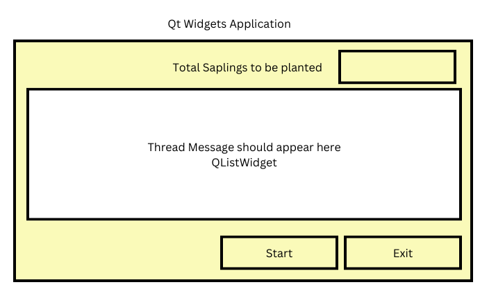
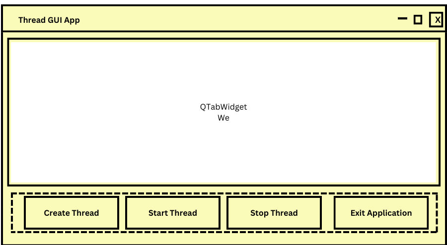

# Day 3

## Multiple thread
<pre>
- Assume there are 3 gardeners
- Every day the forest department gives some saplings to plant
- The first gardener will dig a pit, let's call this person as digger
- The second gardener will plant the saplings with some compost. Let's call this person as planter
- The third gardener will fill the pit and water the sapling, let's call this person as filler
</pre>

## Assignment - You need to develop a GUI application for the Gardener command line application
The GUI shall look as shown below

## Lab - Thread GUI Application

<pre>
- We need to develop a HMI for a multi-threaded application using Qt Widgets Framework
- When we click on the 'Create Thread' button it should add one new Tab in the Tab Widget
- When we click on the 'Start Thread' button, the thread should be started and we should see the threads messages on the respective Thread Tab
- When we click on the 'Stop Thread' button, the thread that is running in that Tab should be stopped
- When we switch between the tabs, we should be able to enable/disable buttons as per the thread status
</pre>
